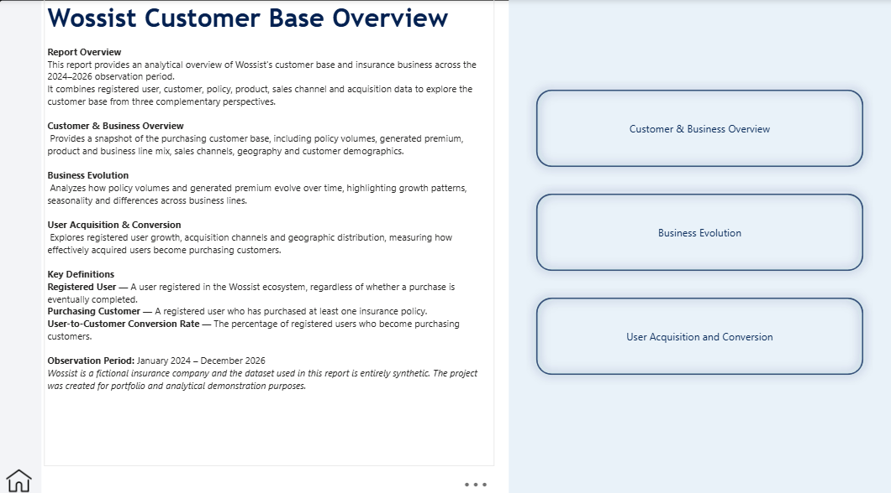
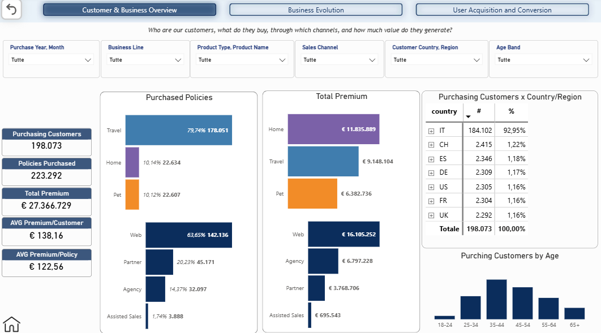
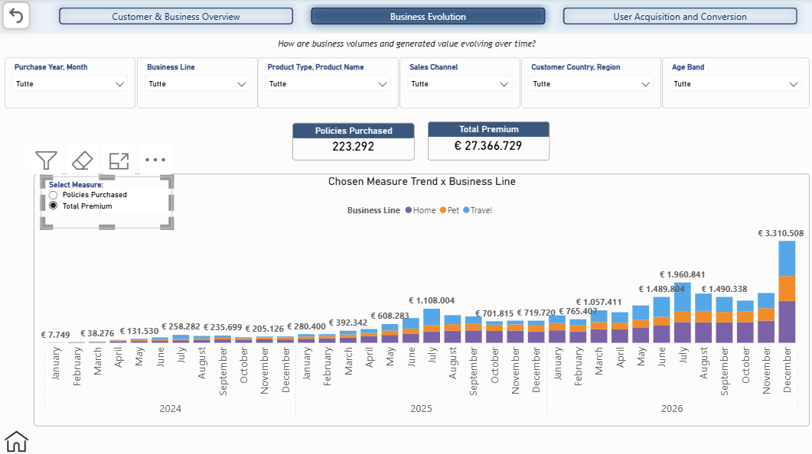
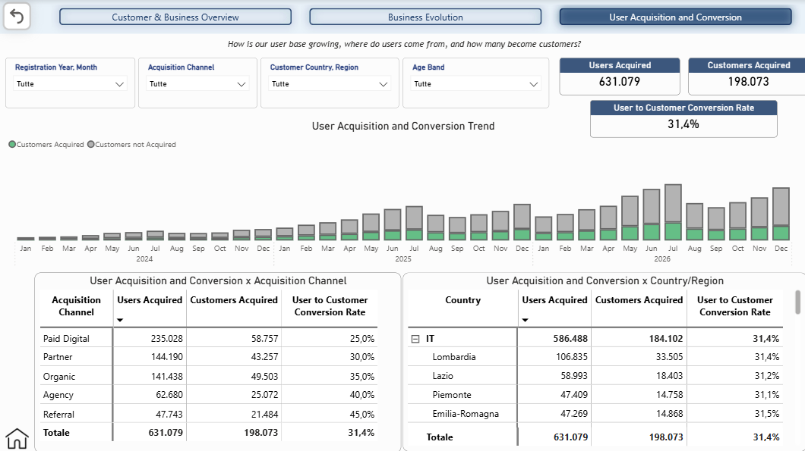

# Wossist Customer Base Overview

## Project Overview

The **Wossist Customer Base Overview** is a Power BI project designed to provide an analytical view of the customer base and insurance business of Wossist, a fictional insurance company operating primarily in the Italian market.

The analysis covers the **January 2024 – December 2026** observation period and combines registered user, customer, policy, product, sales channel and acquisition data.

The report is structured around three complementary analytical perspectives:

1. **Customer & Business Overview**
2. **Business Evolution**
3. **User Acquisition & Conversion**

The dataset used in this project is entirely synthetic and was specifically designed to reproduce realistic insurance customer and business dynamics.

---

## Report Introduction

The report includes an introductory page describing the analytical scope, report structure and main business definitions.

### Key Definitions

- **Registered User** — A user registered in the Wossist ecosystem, regardless of whether a purchase is eventually completed.
- **Purchasing Customer** — A registered user who has purchased at least one insurance policy.
- **User-to-Customer Conversion Rate** — The percentage of registered users who become purchasing customers.

---

## 1. Customer & Business Overview

The first analytical page provides a high-level view of Wossist's purchasing customer base and business composition.

It answers questions such as:

- How many customers purchase Wossist policies?
- How many policies are generated?
- How much premium is generated?
- Which business lines generate the highest volumes and value?
- Through which sales channels are policies purchased?
- Where are purchasing customers located?
- What is the age distribution of the customer base?

### Main KPIs

| KPI | Value |
|---|---:|
| Purchasing Customers | 198,073 |
| Policies Purchased | 223,292 |
| Total Premium | €27.37M |
| Average Premium per Customer | €138.16 |
| Average Premium per Policy | €122.56 |

### Key Insights

**Travel dominates policy volumes.**  
Travel products account for approximately **80% of purchased policies**, making Travel the largest Wossist business line in terms of transaction volume.

**Premium generation tells a different story.**  
Despite its significantly lower policy volume, **Home generates approximately €11.84M in premium**, compared with approximately €9.15M generated by Travel. This highlights the difference between volume contribution and economic value across business lines.

**Web is the primary sales channel.**  
The Web channel accounts for approximately **64% of purchased policies** and generates more than **€16M in premium**.

**The customer base is predominantly Italian.**  
Approximately **93% of purchasing customers are located in Italy**, with Lombardia representing the largest regional customer base.

---

## 2. Business Evolution

The Business Evolution page focuses on how Wossist's insurance business develops over time.

A **Power BI Field Parameter** allows users to dynamically switch the main analytical measure between:

- **Policies Purchased**
- **Total Premium**

The selected measure is analysed monthly and segmented by business line, allowing the same visual to provide two complementary perspectives on business evolution.

### Policies Purchased

### Total Premium

### Analytical Focus

The page makes it possible to identify:

- business growth over time;
- monthly and seasonal patterns;
- changes in policy volumes and generated premium;
- the contribution of each business line to overall business evolution;
- differences between high-volume and high-value business lines.

The two views highlight a particularly important distinction in the Wossist portfolio: **Travel strongly dominates policy volumes, while Home generates a disproportionately high share of total premium despite its lower policy volume.**

The dynamic measure selection makes it possible to explore both perspectives without duplicating report visuals, keeping the page compact while preserving analytical flexibility.
---

## 3. User Acquisition & Conversion

The third analytical page shifts the focus from purchasing customers to the complete registered user base.

It analyses how users enter the Wossist ecosystem and how effectively they become purchasing customers.

### Main KPIs

| KPI | Value |
|---|---:|
| Registered Users | 631,079 |
| Purchasing Customers | 198,073 |
| User-to-Customer Conversion Rate | 31.4% |

### Acquisition Channel Performance

| Acquisition Channel | Registered Users | Purchasing Customers | Conversion Rate |
|---|---:|---:|---:|
| Paid Digital | 235,028 | 58,757 | 25% |
| Partner | 144,190 | 43,257 | 30% |
| Organic | 141,438 | 49,503 | 35% |
| Agency | 62,680 | 25,072 | 40% |
| Referral | 47,743 | 21,484 | 45% |

### Key Insights

**Acquisition volume and conversion quality differ significantly across channels.**

Paid Digital is the largest acquisition source, generating more than **235,000 registered users**, but records the lowest user-to-customer conversion rate at **25%**.

Referral represents a substantially smaller acquisition source but reaches the highest conversion rate at **45%**.

Agency also shows relatively strong conversion performance at **40%**.

This creates a clear distinction between channels focused on **acquisition scale** and channels generating users with a **higher propensity to purchase**.

---

## Data Model

The report is built on a relational analytical model connecting the main stages of the Wossist customer lifecycle.

Core datasets include:

- `customers`
- `products`
- `sales_channels`
- `quotes`
- `policies`
- `renewals`
- `campaigns`
- `customer_interactions`
- `operators`
- `Calendar`

The model follows a dimension-to-fact structure with single-direction relationships where appropriate.

Different date relationships are used depending on the analytical perspective:

- **Purchase Date** for customer and business analysis;
- **Registration Date** for user acquisition analysis.

---

## Main Power BI Measures

The report uses reusable DAX measures including:

- Purchasing Customers
- Policies Purchased
- Total Premium
- Average Premium per Customer
- Average Premium per Policy
- Users Acquired
- Customers Acquired
- User-to-Customer Conversion Rate

A **Power BI Field Parameter** is used in the Business Evolution page to dynamically switch between policy volume and premium analysis.

---

## Report Features

The Power BI report includes:

- interactive slicers;
- hierarchical geographic analysis;
- time-based filtering;
- business line and product filtering;
- sales channel analysis;
- acquisition channel analysis;
- dynamic measure selection;
- page navigation;
- consistent semantic colour coding across business lines.

---

## Tools

- **Power BI Desktop**
- **Power Query**
- **DAX**
- **Python** — synthetic dataset generation and validation
- **CSV / GZIP** — dataset storage
- **GitHub** — project documentation and versioning

---

## Project Files

- [`wossist-customer-base-overview.pbix`](./wossist-customer-base-overview.pbix) — Power BI report
- [`../../dataset/`](../../dataset/) — synthetic datasets and dataset documentation
- [`../../data-model/`](../../data-model/) — data model documentation
- [`../../company-overview/`](../../company-overview/) — Wossist business context and customer journey

---

## Disclaimer

**Wossist is a fictional company.**

All customers, policies, quotes, interactions and other records contained in the project are entirely synthetic.

The project was created exclusively for **portfolio, learning and analytical demonstration purposes**.
